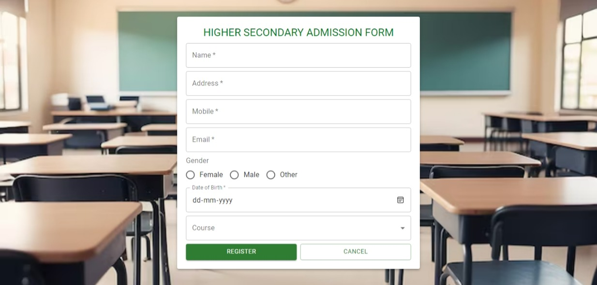

# Registration Form (React + Material UI)

**Description**:  
The Registration Form app is a dynamic form built with React and Material UI, designed for higher secondary admission. It allows users to fill in personal details such as name, address, email, and course preferences. The form is responsive, user-friendly, and ensures a smooth registration experience.

**Tech Stack**: React, Material UI

**Features**:
- Collect personal details including Name, Address, Mobile, Email, Gender, Date of Birth, and Course selection.
- Responsive design that adapts to all screen sizes.
- Clean and modern UI with Material UI components.
- Easy-to-use and intuitive interface.
- Register and Cancel buttons for form submission.

**Deployed Link**:  
You can check out the live version of the Registration Form here: [Registration Form Live](https://registration-react-three.vercel.app/).

